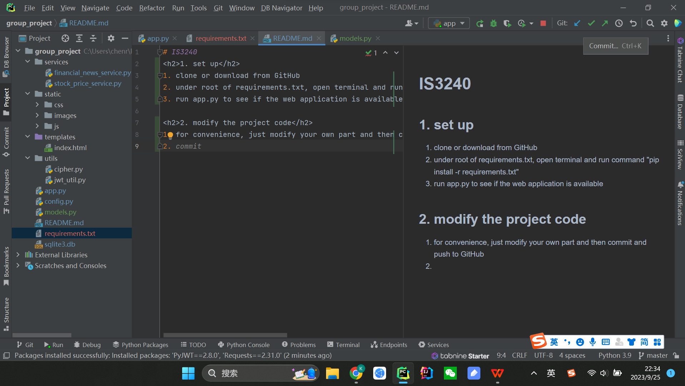
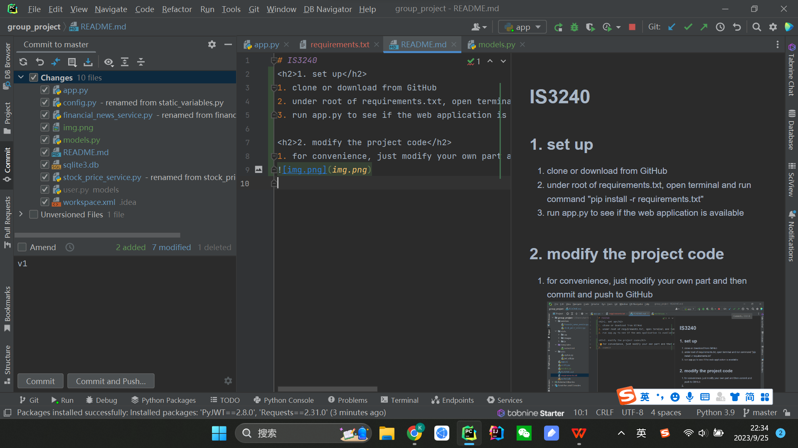

# IS3240
<h2>1. set up</h2>
1. clone or download from GitHub
2. under root of requirements.txt, open terminal and run command "pip install -r requirements.txt"
3. run app.py to see if the web application is available

<h2>2. modify the project code</h2>
1. for convenience, just modify your own part and then commit and push to GitHub
 
- click "commit" in the top right corner

- enter commit message (e.g., "v1"), and then click "commit and push"
